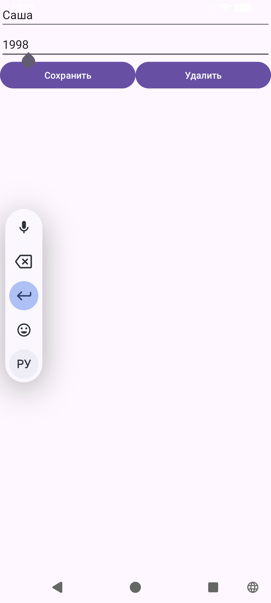

# Добавление, удаление и обновление данных в SQLite

В данной работе по сравнению с предыдущим этапом была добавлена поддержка полного цикла операций CRUD при работе с базой данных **SQLite**.

В частности, реализовано:
* добавление новых записей в базу данных;
* редактирование существующих записей;
* удаление записей;
* отдельный экран (UserActivity) для работы с данными;
* передача идентификатора записи между activity через Intent для определения режима (добавление или редактирование);
* использование класса ContentValues для вставки и обновления данных.

